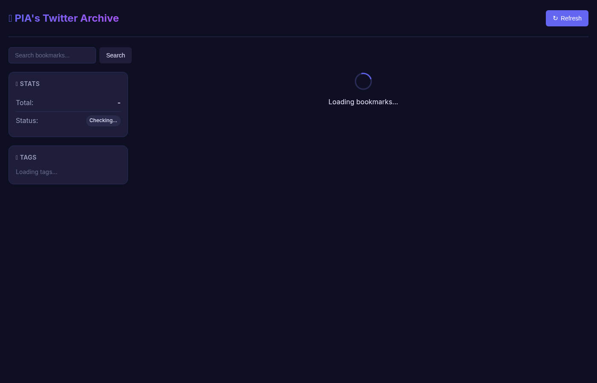

# 🐦 PIA's Twitter Archive

A self-hosted Twitter bookmarks manager that fetches your bookmarks via the bird CLI and provides a clean, searchable web interface.



## Features

- 📥 **Fetch bookmarks** directly from Twitter via bird CLI
- 🔍 **Search** by author or content
- 🏷️ **Tag system** - organize with custom tags
- 📱 **Clean, minimal UI** - dark mode by default
- 📊 **Stats dashboard** - see your bookmark count
- 🗑️ **Delete** unwanted bookmarks
- 🔗 **Quick links** - open tweets directly on Twitter

## Quick Start

```bash
# Install dependencies
npm install

# Start the server
npm start

# Open in browser
open http://localhost:3456
```

## How to Use

1. **Refresh** - Click the "Refresh" button to fetch your latest Twitter bookmarks
2. **Search** - Use the search box to find bookmarks by author or content
3. **Filter by Tag** - Click on a tag in the sidebar to filter bookmarks
4. **Add Tags** - Click on any bookmark to open the detail view and add/remove tags
5. **Open on Twitter** - Click "Open on Twitter →" to view the original tweet

## API Endpoints

| Method | Endpoint | Description |
|--------|----------|-------------|
| GET | `/api/status` | Check bird CLI and database status |
| GET | `/api/bookmarks` | List bookmarks (with pagination, search, tag filter) |
| POST | `/api/bookmarks/refresh` | Fetch new bookmarks from bird CLI |
| GET | `/api/bookmarks/:id` | Get single bookmark details |
| DELETE | `/api/bookmarks/:id` | Delete a bookmark |
| POST | `/api/bookmarks/:id/tags` | Add tag to bookmark |
| DELETE | `/api/bookmarks/:id/tags/:tag` | Remove tag from bookmark |
| GET | `/api/tags` | List all tags with counts |

## Query Parameters

### GET /api/bookmarks
- `page` - Page number (default: 1)
- `limit` - Items per page (default: 20)
- `search` - Search query (searches author and content)
- `tag` - Filter by tag name

## File Structure

```
twitter-archive/
├── data/              # SQLite database
│   └── bookmarks.db
├── public/            # Frontend files
│   ├── index.html
│   ├── style.css
│   └── app.js
├── server.js          # Express server + API
├── database.js        # SQLite wrapper
├── fetcher.js         # bird CLI integration
└── package.json
```

## Requirements

- Node.js 16+
- bird CLI installed and authenticated (`npm install -g @steipete/bird`)
- Twitter account with bookmarks

## Tech Stack

- **Backend:** Node.js + Express
- **Database:** SQLite (better-sqlite3)
- **Frontend:** Vanilla JS + CSS (no build step)
- **Data Source:** bird CLI

## Development

```bash
# Run in development mode
npm run dev

# The server will auto-reload on changes
```

## License

ISC - Built with ❤️ by PIA